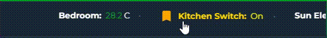

<a href="https://www.buymeacoffee.com/cataseven" target="_blank">
  
</a>      

# 🔶 Strip Card for Home Assistant

## ✨ Features

- 🔁 Horizontally scrolling ticker layout
- 🧩 Supports multiple entities and attributes
- 🎨 Global and per-entity styling
- 🖱️ Click to open `more-info` or trigger an action
- ⏸️ Optional pause on hover
- ⚙️ Rich customization: icons, colors, attributes, units, etc.

---

## 📦 Installation

### Method 1 - Download From HACS
Search for Strip Card and download

### Method 2 - Manual
- Copy `strip-card.js` into your `/www/community/strip-card/` folder inside your Home Assistant config.
- Go to **Settings > Dashboards > Resources**
- Click **Add Resource**
- URL: `/local/community/Strip-Card/strip-card.js`

#### Or via YAML:
```yaml
lovelace:
  resources:
    - url: /local/community/Strip-Card/strip-card.js
      type: module
```

---


# 🧩 Custom Card Configuration Options

## General Options

| **Option**            | **Type**   | **Default**                 | **Description**                                                                 |
|-----------------------|------------|-----------------------------|---------------------------------------------------------------------------------|
| `title`               | `string`   | `""`                        | Sets the card title.                                                            |
| `duration`            | `number`   | `20`                        | Duration (in seconds) for one full scroll cycle. Lower values = faster scroll. |
| `font_size`           | `string`   | `"14px"`                    | Sets the font size for text.                                                    |
| `border_radius`       | `string`   | `"0px"`                     | Controls card corner roundness (e.g., `"10px"`).                               |
| `card_height`         | `string`   | `"50px"`                    | Fixed height of the card.                                                       |
| `card_width`          | `string`   | `""`                        | Fixed width of the card. Leave blank for automatic width.                      |
| `separator`           | `string`   | `"•"`                       | Symbol shown between each entity item.                                          |
| `pause_on_hover`      | `boolean`  | `false`                     | 🖱️ Pauses animation when the mouse hovers over the card.                       |
| `continuous_scroll`   | `boolean`  | `true`                      | If true, scrolling loops continuously. If false, scrolls once and stops.       |
| `vertical_scroll`     | `boolean`  | `false`                     | Changes scroll direction from horizontal to vertical.                          |
| `vertical_alignment`  | `string`   | `"stack"`                   | Used with vertical scroll: `"stack"` (top-to-bottom) or `"inline"` (side-by-side). |
| `fading`              | `boolean`  | `false`                     | Adds fade effect at the card’s edges.                                           |
| `show_icon`           | `boolean`  | `false`                     | Displays the entity icon if true.                                               |
| `unit_position`       | `string`   | `"right"`                   | Position of unit label relative to value. Options: `"left"` or `"right"`.     |

## Color Options

| **Option**      | **Default**                       | **Description**                           |
|------------------|-----------------------------------|-------------------------------------------|
| `name_color`     | `var(--primary-text-color)`       | Color of the entity name.                 |
| `value_color`    | `var(--primary-color)`            | Color of the entity value.                |
| `unit_color`     | `var(--secondary-text-color)`     | Color of the unit text.                   |
| `icon_color`     | `var(--paper-item-icon-color)`    | Color of the entity icon.                 |

## Per-Entity Options (`entities`)

| **Sub-Option**       | **Type**     | **Default**              | **Description**                                                                 |
|----------------------|--------------|---------------------------|----------------------------------------------------------------------------------|
| `entity`             | `string`     | **Required**              | The `entity_id` to display (e.g., `sensor.temp`).                                |
| `name`               | `string`     | `friendly_name`           | Overrides the default entity name.                                               |
| `icon`               | `string`     | Default entity icon       | Overrides the default icon (e.g., `"mdi:weather-sunny"`).                        |
| `attribute`          | `string`     | `state`                   | Displays a specific attribute instead of the state.                              |
| `value_template`     | `string`     | `state`                   | A Jinja2 template to customize the displayed value.                              |
| `unit`               | `string`     | `unit_of_measurement`     | Overrides the default unit of measurement.                                       |
| `unit_position`      | `string`     | Inherits from card        | Overrides the global unit position for this entity.                              |
| `show_icon`          | `boolean`    | Inherits from card        | Overrides icon visibility for this specific entity.                              |
| `service`            | `string`     | —                         | Home Assistant service to call on click (e.g., `"light.toggle"`).               |
| `data`               | `object`     | —                         | Additional data to pass with the service call (e.g., `{"entity_id": "light.kitchen"}`). |


---

## 🧾 Example Configuration



```yaml
type: custom:strip-card
duration: 20
show_icon: false
border_radius: 12px
card_height: 50px
card_width: 250px
entities:
  - entity: sensor.temperature
    name: Bedroom
  - entity: switch.kitchen
    name: Kitchen Switch
    service: switch.toggle
    data:
      entity_id: switch.kitchen
    show_icon: true
    icon_color: orange
    icon: mdi:lightbulb
    name_color: gold
    value_color: yellow
    unit_color: silver
  - entity: sun.sun
    attribute: elevation
    name: Sun Elevation
    unit: °
```

```yaml
type: custom:strip-card
title: System Status
duration: 25
font_size: 15px
border_radius: 12px
card_height: 50px
card_width: 250px
separator: "•"
pause_on_hover: true
show_icon: false
entities:
  - entity: sensor.cpu_temp
    name: CPU
    unit: °C
    unit_position: left
    value_color: "#e53935"
  - entity: sensor.disk_free
    name: Disk
    unit: GB
    value_color: "#43a047"
    name_color: "#000"
  - entity: binary_sensor.door
    name: Door
    show_icon: true
    icon_color: "#ffa000"
  - entity: sensor.co2_level
    name: CO₂
    unit: ppm
    show_icon: true
    icon_color: "#2196f3"
    name_color: "#222"
    value_color: "#2196f3"
    unit_color: "#666"
```

Vertical Scroll Example
```yaml
  type: custom:strip-card
  title: Comprehensive Vertical Scroll
  entities:
    - entity: sun.sun
      name: "Sun Position"
      show_icon: true
    - entity: zone.home
      name: "People at Home"
      show_icon: true
    - entity: sensor.rain_sensor
      name: "Rain Sensor"
      show_icon: true
    - entity: sensor.weather_station_humidity
      name: "Humidity"
      show_icon: true
  duration: 20
  separator: "•"
  font_size: "14px"
  card_height: "300px" # A taller card works well for vertical scrolling.
  card_width:  "100pxpx" 
  fading: true
  pause_on_hover: false
  vertical_scroll: true
  vertical_alignment: 'stack'
  continuous_scroll: true
```

Color Template Example

```yaml
type: custom:strip-card
duration: 20
show_icon: true
entities:
  - entity: sensor.temperature
    name: Bedroom
    icon: mdi:thermometer
    icon_color: orange
    name_color: >
      {{ states['sensor.temperature'].state < 21 ? 'blue' :
      (states['sensor.temperature'].state <= 25 ? 'green' : 'red') }}
    value_color: >
      {{ states['sensor.temperature'].state < 21 ? 'blue' :
      (states['sensor.temperature'].state <= 25 ? 'green' : 'red') }}
    unit_color: >
      {{ states['sensor.temperature'].state < 21 ? 'blue' :
      (states['sensor.temperature'].state <= 25 ? 'green' : 'yellow') }}
  - entity: person.man
    name: Man
    icon: mdi:account
    value_color: >
      {{ states['person.man'].state === 'home' ? 'blue' : 'gray' }}
  - entity: person.woman
    name: Woman
    icon: mdi:account-outline
    value_color: >
      {{ states['person.woman'].state === 'home' ? 'green' : 'gray' }}
```

Another Template Example
```yaml
type: custom:strip-card
duration: >
  {{ states['sensor.temperature'].state < 21 ? '10' :
  (states['sensor.temperature'].state <= 25 ? '20' : '10') }}
entities:
  - entity: sensor.temperature
    name: Oda Sıcaklığı
    show_icon: |
      {{ states['sensor.temperature'].state > 28 }}
    icon: >
      {{ states['sensor.temperature'].state < 21 ? 'mdi:snowflake' :
      (states['sensor.temperature'].state <= 25 ? 'mdi:thermometer' :
      'mdi:fire') }}
    unit_color: >
      {{ states['sensor.temperature'].state < 21 ? 'blue' :
      (states['sensor.temperature'].state <= 25 ? 'green' : 'red') }}
    value_template: >
      {{ states['sensor.temperature'].state < 21 ? 'Cold' : 
      (states['sensor.temperature'].state <= 25 ? 'Fine' : 'Damn Hot') }}
    value_color: >
      {{ states['sensor.temperature'].state < 21 ? 'blue' :
      (states['sensor.temperature'].state <= 25 ? 'green' : 'yellow') }}      
```


## 🧩 Entity-Level Customization

You can define each entity as an object to override global styles:

```yaml
- entity: sensor.example
  name: Example
  unit: kWh
  attribute: temperature
  show_icon: true
  icon_color: "#ff9800"
  name_color: "#333"
  value_color: "#4caf50"
  unit_color: "#999"
```

You can also just list the entity ID for default behavior:

```yaml
- sensor.simple
```

---

## 🖊️ Regex Support for Entity Friendly Names 
Allows removing or replacing parts of the friendly name via regular expressions.
- `string`: treated as pattern with flags `gi`, replacement `""`.
- `object`: `{ pattern: string, flags?: string, replace?: string }`.

Example:

```yaml
name_replace:
  - pattern: your Text
    flags: 'gi'
    replace: 'your new Text'
  - pattern: your Text 2
    flags: 'gi'
    replace: ''
```
```yaml
type: custom:strip-card
entities:
  - entity: sensor.temperature     ##friendly name: LIVING ROOM  -> Result: LIVING
  - entity: sensor.temperature_2   ##friendly name: KIDS ROOM    -> Result: KIDS
  - entity: sensor.temperature_3   ##friendly name: GUEST ROOM   -> Result: GUEST
name_replace:
  - pattern: "ROOM"
    replace: ""
```


## ⚡ Tap to Call Action

By default, clicking an item opens the `more-info` dialog. You can also trigger a service/action instead:

```yaml
- entity: switch.kitchen
  name: Kitchen Switch
  service: switch.toggle
  data:
    entity_id: switch.kitchen
```

---

## 🧑‍🎨 Developer Notes

- This card uses `ha-card` and `ha-state-icon` for native look & feel.
- Per-entity styling allows full customization.
- Animation is CSS-based and smooth across all modern browsers.

---

## 📄 License

MIT License  
Created by cataseven

---

## ⭐ Support
<a href="https://www.buymeacoffee.com/cataseven" target="_blank">
  
</a>      

If you like this card, feel free to ⭐ star the project on GitHub and share it with the Home Assistant community!
