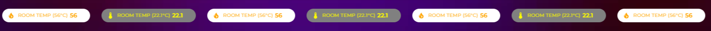
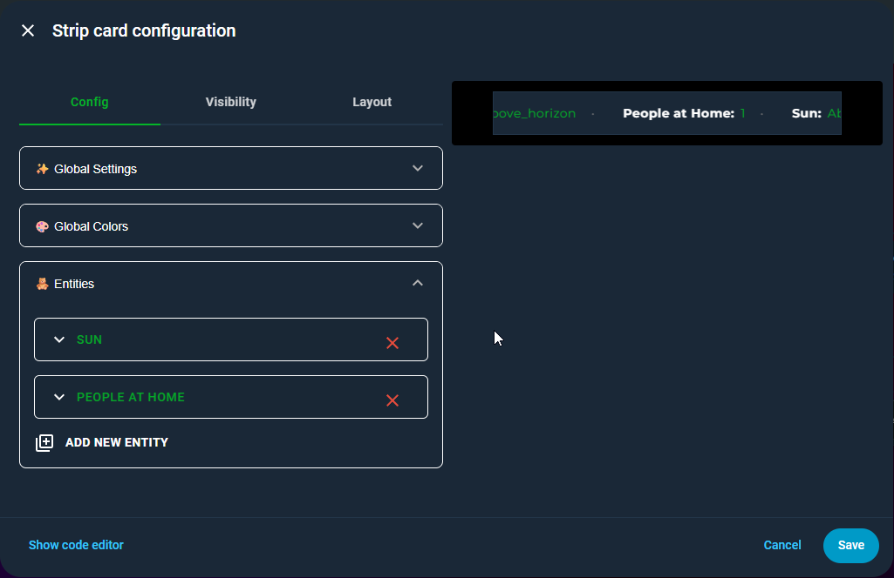
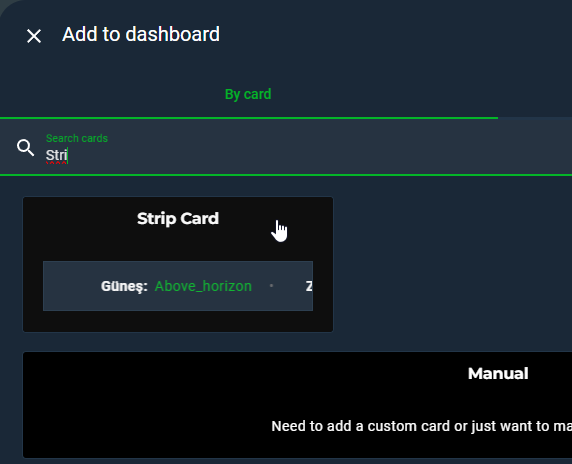
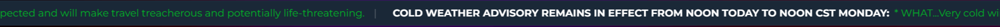

<a href="https://www.buymeacoffee.com/cataseven" target="_blank">
  
</a>

# 🔶 Strip Card for Home Assistant

A highly flexible scrolling ticker card for Home Assistant dashboards supporting templates, bidirectional scrolling, badge mode, rich per‑entity styling, entity visibility rules, action handling (tap/hold/double‑tap), and responsive full‑width layouts.




---

## ✨ Features

* UI Editor
  
* Horizontal and vertical scrolling layouts
* Continuous or single‑cycle scrolling
* Direction control (`left` / `right`)
* Badge/Chip display mode
* Per‑entity actions: tap / hold / double‑tap
* Supports `more-info`, `toggle`, `navigate`, `url`, `assist`, `call-service`
* Full template support for value, colors, icons, titles, visibility & more
* Per‑entity color, icon, attribute & unit overrides
* Conditional rendering via `visible_if`
* 🔁 **Repeat items from attribute arrays via `repeat_on`** (alerts, todos, forecasts)
* Regex‑based friendly name replacement
* Full‑width responsive mode with sidebar & scrollbar compensation
* Optional fading edges and hover‑pause
* Transparent mode
* Works with `states()` style HA templating

---

## 📦 Installation

### HACS

Search for **Strip Card** and install.

### Manual

Place `strip-card.js` under:

```
/www/community/strip-card/
```

Then add resource:

```
lovelace:
  resources:
    - url: /local/community/strip-card/strip-card.js
      type: module
```



---

# 🧩 Configuration Options

## Global Options

| Option               | Type           | Default                                          | Description                                                                                                |
| -------------------- | -------------- | ------------------------------------------------ | ---------------------------------------------------------------------------------------------------------- |
| `title`              | string         | `""`                                             | Card header title (templatable)                                                                            |
| `duration`           | number/string  | `20`                                             | Scroll duration (one full cycle), templatable                                                              |
| `scroll_speed`       | number/string  | —                                                | px/s movement speed. Overrides `duration` when set                                                         |
| `scroll_direction`   | string         | `"left"`                                         | `left` or `right`                                                                                          |
| `continuous_scroll`  | boolean        | `true`                                           | Continuous loop or one‑shot                                                                                |
| `pause_on_hover`     | boolean        | `false`                                          | Hover to pause animation                                                                                   |
| `vertical_scroll`    | boolean        | `false`                                          | Enables vertical scrolling                                                                                 |
| `vertical_alignment` | string         | `"stack"`                                        | `stack` or `inline`                                                                                        |
| `fading`             | boolean        | `false`                                          | Edge fade effect                                                                                           |
| `font_size`          | string         | `"14px"`                                         | Text size                                                                                                  |
| `separator`          | string         | `"•"`                                            | Separator between items                                                                                    |
| `empty_message`      | string/boolean | `"No entities passed the visible_if conditions"` | Message shown when no entities remain after filtering (`visible_if` / `repeat_on`). Set `false` to disable |
| `border_radius`      | string         | `"0px"`                                          | Card border radius                                                                                         |
| `card_height`        | string         | `"50px"`                                         | Fixed card height                                                                                          |
| `card_width`         | string         | `"400px"`                                        | Fixed width; ignored when `full_width=true`                                                                |
| `transparent`        | boolean        | `false`                                          | Removes card background & border                                                                           |
| `full_width`         | boolean        | `false`                                          | Expands card across viewport minus sidebar/scrollbar                                                       |
| `badge_style`        | boolean        | `false`                                          | Switch to chip/badge layout                                                                                |

---

## Color Options

| Option        | Default                       | Description  |
| ------------- | ----------------------------- | ------------ |
| `name_color`  | `var(--primary-text-color)`   | Entity label |
| `value_color` | `var(--primary-color)`        | Value color  |
| `unit_color`  | `var(--secondary-text-color)` | Unit suffix  |
| `icon_color`  | `var(--primary-text-color)`   | Icon color   |

### Badge/Chip style color options

If `badge_style: true`:

| Option              | Default                           |
| ------------------- | --------------------------------- |
| `badge_background`  | `var(--primary-background-color)` |
| `badge_label_color` | `var(--secondary-text-color)`     |
| `badge_value_color` | `var(--primary-text-color)`       |
| `badge_height`      | `"28px"`                          |
| `badge_font_size`   | `"12px"`                          |
| `badge_icon_size`   | `"16px"`                          |

---

## Entity‑Level Options

| Option           | Type                    | Description                                          |
| ---------------- | ----------------------- | ---------------------------------------------------- |
| `entity`         | string                  | HA entity id (required unless `value_template` used) |
| `repeat_on`      | template                | 🔁 Template returning an array to repeat this entry  |
| `name`           | string                  | Override label (templatable)                         |
| `attribute`      | string                  | Use attribute instead of state                       |
| `value_template` | string                  | HA template for value (`states()` supported)         |
| `unit`           | string                  | Override measurement unit (templatable)              |
| `icon`           | string                  | Custom icon (templatable)                            |
| `show_icon`      | boolean/string/template | Show icon override                                   |
| `visible_if`     | template                | Render only if true                                  |
| `name_color`     | template                | Override color                                       |
| `value_color`    | template                | Override color                                       |
| `unit_color`     | template                | Override color                                       |
| `icon_color`     | template                | Override color                                       |

---

## 🔁 Repeat Over Attribute Arrays (`repeat_on`)

Use `repeat_on` when an entity attribute (or any template) returns an **array** and you want to render **one strip item per element**.

### Template variables available when `repeat_on` is used

When repeating, these variables are injected into templates:

* 🧱 `item` — current array element
* 🔢 `index` — 0‑based index of the element
* 🏷️ `entity` — source entity id (string)
* 📦 `stateObj` — full HA state object of the source entity

These can be used in `visible_if`, `value_template`, `name`, `unit`, colors, and `icon`.


---

## Action Options

Entities support 3 gesture bindings:

* `tap_action`
* `hold_action`
* `double_tap_action`

Supported actions include:

* `more-info`
* `toggle`
* `navigate`
* `url`
* `assist`
* `none`
* `call-service`
* `perform-action`

Example:

```yaml
- entity: switch.kitchen
  tap_action:
    action: toggle
  hold_action:
    action: more-info
  double_tap_action:
    action: navigate
    navigation_path: /dashboard/home
```

---

### Visibility behavior

* `visible_if` is evaluated **per repeated item**.
* If `repeat_on` returns `undefined`, `null`, `false`, an empty string, or an empty array, the entry produces **no items** (nothing is shown for that entry).
## Visibility Rules

`visible_if` allows conditional rendering:

```yaml
visible_if: "{{ states('sun.sun') == 'above_horizon' }}"
```

If the expression is false, the entity is omitted.

---

## Template Support

The card supports Home Assistant style expressions:

```yaml
value_template: "{{ states('sensor.temp') }}"
name: "{{ states('person.john') }}"
icon_color: "{{  'red' if states('sensor.temp')|float > 30 else 'blue' }}"
```

Works with:

* `states()`
* inline expressions
* multi‑expression interpolation
* numeric comparison
* conditional icon rendering

---

## Template Almost Everything

```yaml
type: custom:strip-card
title: |
  {{ 'Temperature Strip – ' + states('sensor.temperature') + '°C' }}
duration: |
  {{ states('sensor.temperature') < 18
     ? 30
     : (states('sensor.temperature') <= 26 ? 20 : 10) }}
separator: |
  {{ states('sensor.temperature') < 18
     ? '❄'
     : (states('sensor.temperature') <= 26 ? '•' : '🔥') }}
font_size: |
  {{ states('sensor.temperature') > 26 ? '18px' : '14px' }}
name_color: |
  {{ states('sensor.temperature') < 18
     ? 'cyan'
     : (states('sensor.temperature') <= 26 ? 'springgreen' : 'orange') }}
value_color: |
  {{ states('sensor.temperature') < 18
     ? 'dodgerblue'
     : (states('sensor.temperature') <= 26 ? 'limegreen' : 'orangered') }}
unit_color: |
  {{ states('sensor.temperature') < 18
     ? 'powderblue'
     : (states('sensor.temperature') <= 26 ? 'palegreen' : 'gold') }}
icon_color: |
  {{ states('sensor.temperature') < 18
     ? 'aqua'
     : (states('sensor.temperature') <= 26 ? 'lime' : 'red') }}
show_icon: |
  {{ states('sensor.temperature') > 0 }}
pause_on_hover: true
border_radius: |
  {{ states('sensor.temperature') > 26 ? '16px' : '8px' }}
card_height: |
  {{ states('sensor.temperature') > 26 ? '170px' : '250px' }}
card_width: |
  {{ states('sensor.temperature') < 18 ? '260px' : '320px' }}
fading: true
vertical_scroll: false
vertical_alignment: stack
continuous_scroll: true
transparent: false
scroll_speed: |
  {{ states('sensor.temperature') < 18
     ? 30
     : (states('sensor.temperature') <= 26 ? 50 : 80) }}
scroll_direction: right
full_width: false
badge_style: true
badge_background: |
  {{ states('sensor.temperature') < 18
     ? 'steelblue'
     : (states('sensor.temperature') <= 26 ? 'seagreen' : 'firebrick') }}
badge_label_color: |
  {{ states('sensor.temperature') < 18
     ? 'aliceblue'
     : (states('sensor.temperature') <= 26 ? 'mintcream' : 'lightyellow') }}
badge_value_color: white
badge_height: |
  {{ states('sensor.temperature') > 26 ? '32px' : '28px' }}
badge_font_size: |
  {{ states('sensor.temperature') > 26 ? '13px' : '12px' }}
badge_icon_size: |
  {{ states('sensor.temperature') > 26 ? '18px' : '16px' }}
entities:
  - entity: sensor.temperature
    name: |
      {{ 'Room Temp (' + states('sensor.temperature') + '°C)' }}
    value_template: |
      {{ states('sensor.temperature') }}
    unit: |
      {{ '°C' }}
    icon: |
      {{ states('sensor.temperature') < 18
         ? 'mdi:snowflake-alert'
         : (states('sensor.temperature') <= 26
            ? 'mdi:thermometer-check'
            : 'mdi:fire-alert') }}
    show_icon: |
      {{ states('sensor.temperature') > 0 }}
    visible_if: |
      {{ states('sensor.temperature') > 0 }}
    name_color: |
      {{ states('sensor.temperature') < 18
         ? 'mediumturquoise'
         : (states('sensor.temperature') <= 26 ? 'mediumspringgreen' : 'coral') }}
    value_color: |
      {{ states('sensor.temperature') < 18
         ? 'deepskyblue'
         : (states('sensor.temperature') <= 26 ? 'chartreuse' : 'crimson') }}
    unit_color: |
      {{ states('sensor.temperature') < 18
         ? 'lightcyan'
         : (states('sensor.temperature') <= 26 ? 'darkseagreen' : 'yellow') }}
    icon_color: |
      {{ states('sensor.temperature') < 18
         ? 'lightskyblue'
         : (states('sensor.temperature') <= 26 ? 'forestgreen' : 'darkred') }}
    separator: |
      {{ states('sensor.temperature') < 18
         ? '❄'
         : (states('sensor.temperature') <= 26 ? '•' : '🔥') }}
    badge_background: |
      {{ states('sensor.temperature') < 18
         ? 'midnightblue'
         : (states('sensor.temperature') <= 26 ? 'darkgreen' : 'maroon') }}
    badge_label_color: |
      {{ states('sensor.temperature') < 18
         ? 'lightblue'
         : (states('sensor.temperature') <= 26 ? 'honeydew' : 'mistyrose') }}
    badge_value_color: |
      {{ states('sensor.temperature') < 18
         ? 'cyan'
         : (states('sensor.temperature') <= 26 ? 'lime' : 'orange') }}
    tap_action:
      action: more-info
    hold_action:
      action: assist
    double_tap_action:
      action: perform-action
      perform_action: ""
      target: {}
```

---

## ✅ Example: NWS Alerts (Repeat Over Array)

If your sensor returns below attributes
```yaml
Alerts:
  - Event: Cold Weather Advisory
    ID: 66aebbdf-c1cf-7004-04ac-7946e90c7c17
    URL: >-
      https://api.weather.gov/alerts/urn:oid:2.49.0.1.840.0.c9655a94fdf1f8075e3ee0334a04035d67c91766.001.1
    Headline: COLD WEATHER ADVISORY REMAINS IN EFFECT UNTIL NOON CST MONDAY
    Type: Update
    Status: Actual
    Severity: Moderate
    Certainty: Likely
    Sent: "2026-01-18T13:41:00-06:00"
    Onset: "2026-01-18T13:41:00-06:00"
    Expires: "2026-01-18T21:45:00-06:00"
    Ends: "2026-01-19T12:00:00-06:00"
    AreasAffected: >-
      West Polk; Norman; Clay; Kittson; Roseau; Lake Of The Woods; West
      Marshall; East Marshall; North Beltrami; Pennington; Red Lake; East Polk;
      North Clearwater; South Beltrami; Mahnomen; South Clearwater; Hubbard;
      West Becker; East Becker; Wilkin; West Otter Tail; East Otter Tail;
      Wadena; Grant; Towner; Cavalier; Pembina; Benson; Ramsey; Eastern Walsh
      County; Eddy; Nelson; Grand Forks; Griggs; Steele; Traill; Barnes; Cass;
      Ransom; Sargent; Richland; Western Walsh County
    Description: |-
      * WHAT...Very cold wind chills as low as 40 below expected.

      * WHERE...Portions of central, north central, northwest, and west
      central Minnesota and northeast and southeast North Dakota.

      * WHEN...Until noon CST Monday.

      * IMPACTS...The dangerously cold wind chills as low as 40 below zero
      could cause frostbite on exposed skin in as little as 10 minutes.
    Instruction: |-
      Use caution while traveling outside. Wear appropriate clothing, a
      hat, and gloves.
  - Event: Blizzard Warning
    ID: 2274a010-f718-6266-76a7-5af3756f64ab
    URL: >-
      https://api.weather.gov/alerts/urn:oid:2.49.0.1.840.0.713fd1c091afc8d7b3dfdd2926996c99e484b2d7.002.1
    Headline: BLIZZARD WARNING REMAINS IN EFFECT UNTIL 9 PM CST THIS EVENING
    Type: Update
    Status: Actual
    Severity: Extreme
    Certainty: Likely
    Sent: "2026-01-18T13:40:00-06:00"
    Onset: "2026-01-18T13:40:00-06:00"
    Expires: "2026-01-18T21:00:00-06:00"
    Ends: "2026-01-18T21:00:00-06:00"
    AreasAffected: >-
      Norman; Clay; Roseau; East Marshall; Pennington; Red Lake; East Polk;
      Mahnomen; West Becker; Wilkin; West Otter Tail; Grant; Barnes; Cass;
      Ransom; Sargent; Richland
    Description: |-
      * WHAT...Blizzard conditions. Additional snow accumulations up to
      one inch. Winds gusting as high as 55 mph.

      * WHERE...Portions of northwest and west central Minnesota and
      southeast North Dakota.

      * WHEN...Until 9 PM CST this evening.

      * IMPACTS...Whiteout conditions are expected and will make travel
      treacherous and potentially life-threatening.
    Instruction: |-
      Persons should consider delaying all travel. Motorists should use
      extreme caution if travel is absolutely necessary.
configuration_type: GPS Location
gps_location: 46.7258996,-97.1193751
attribution: Data provided by Weather.gov
icon: mdi:alert
friendly_name: NWS Alerts Alerts
```



```yaml
type: custom:strip-card
entities:
  - entity: sensor.nws_alerts
    repeat_on: "{{ state_attr(entity, 'Alerts') }}"
    value_template: "{{ item.Description }}"
    name: "{{ item.Headline  }}"
    visible_if: "{{ item.Status == 'Actual' }}"
duration: "0"
separator: "|"
font_size: 20px
scroll_speed: "100"
grid_options:
  columns: full
  rows: auto
```
---
## ✅ Example: Weather Attributes Strip


```yaml
type: custom:strip-card
entities:
  - entity: weather.home
    name: Temp
    attribute: temperature
    unit: "{{ state_attr(entity, 'temperature_unit') }}"
  - entity: weather.home
    name: Feels
    attribute: apparent_temperature
    unit: "{{ state_attr(entity, 'temperature_unit') }}"
  - entity: weather.home
    name: Dew
    attribute: dew_point
    unit: "{{ state_attr(entity, 'temperature_unit') }}"
  - entity: weather.home
    name: Humidity
    attribute: humidity
    unit: "%"
  - entity: weather.home
    name: Clouds
    attribute: cloud_coverage
    unit: "%"
  - entity: weather.home
    name: UV
    attribute: uv_index
  - entity: weather.home
    name: Pressure
    attribute: pressure
    unit: "{{ state_attr(entity, 'pressure_unit') }}"
  - entity: weather.home
    name: Wind
    value_template: >-
      {{ state_attr(entity, 'wind_speed') }} {{ state_attr(entity,
      'wind_speed_unit') }}
  - entity: weather.home
    name: Gust
    value_template: >-
      {{ state_attr(entity, 'wind_gust_speed') }} {{ state_attr(entity,
      'wind_speed_unit') }}
  - entity: weather.home
    name: Visibility
    attribute: visibility
    unit: "{{ state_attr(entity, 'visibility_unit') }}"
```
---
## Full Width Responsive Mode

Enabling:

```yaml
full_width: true
```

Card expands to full viewport minus:

* sidebar width (observed dynamically)
* scrollbar width (observed dynamically)

Result: no overflow or layout breakage in dashboards.

---

## Badge/Chip Mode

```yaml
badge_style: true
```

Shows compact badges:

```yaml
entities:
  - entity: sensor.temp
    name: Temp
```

Each chip supports icon, label, value & template colors.

---

## Regex Friendly Name Replacement

Useful for trimming repeated text:

```yaml
name_replace:
  - pattern: "ROOM"
    replace: ""
```

---

## Example: Basic

```yaml
type: custom:strip-card
show_icon: true
entities:
  - sensor.temperature
  - sensor.humidity
```

---

## Example: Vertical

```yaml
type: custom:strip-card
vertical_scroll: true
vertical_alignment: stack
continuous_scroll: true
card_height: 300px
entities:
  - entity: sun.sun
  - entity: zone.home
  - entity: sensor.humidity
```

---

## Example: Actions & Templates

```yaml
type: custom:strip-card
show_icon: true
entities:
  - entity: sensor.temperature
    value_template: "{{ states('sensor.temperature') }} °C"
    value_color: "{{ 'red' if states('sensor.temperature')|float > 28 else 'blue' }}"
    tap_action:
      action: more-info
  - entity: switch.kitchen
    tap_action:
      action: perform-action
      perform_action: switch.toggle
      target:
        entity_id: switch.zone_11
    hold_action:
      action: assist
```

## Developer Notes

* Uses `ha-card` for native appearance
* CSS‑based animation (no JS timers)
* Templates evaluated via controlled execution context
* Sidebar & scrollbar observation for responsive mode

---

## License

MIT

---

## Support

If you enjoy this card, consider supporting the author:

<a href="https://www.buymeacoffee.com/cataseven" target="_blank">
  
</a>
